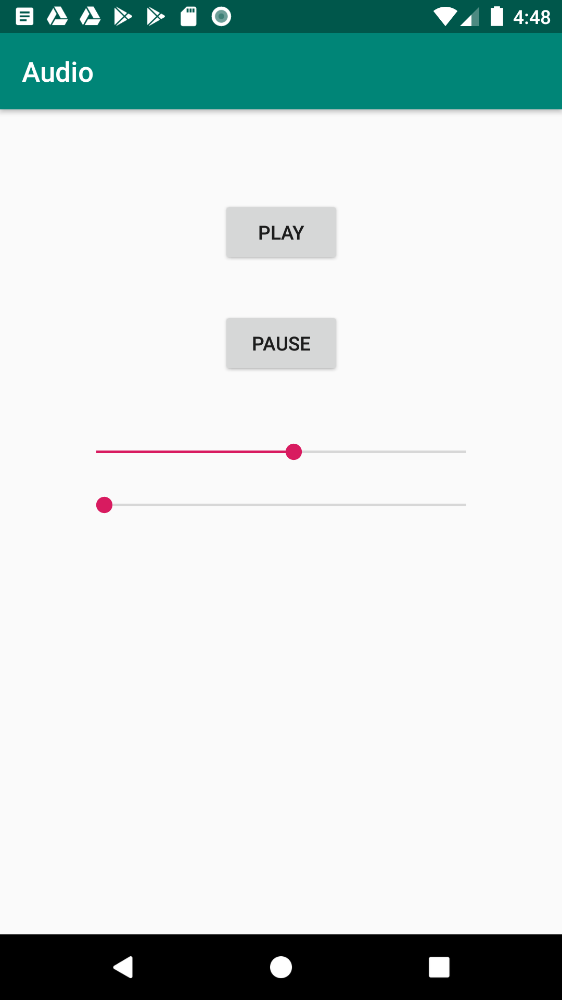

# android_audio_starter_code
This app is a simple audio player. I used a downloaded mp3 file to demonstrate how audio player works.
Start and pause buttons are for controlling the audio. Also two seekbars for volume and scrub are added.
Android MedeaPlayer and AudioManager are used in this app. 

Feel free to change this code and use in your application

Note: remove the screenshot of the app inside the drawable before using :) .

Thank you.

[Oreo Development Course](https://www.udemy.com/share/101Y5MAkMcdl5bRXo=/)

